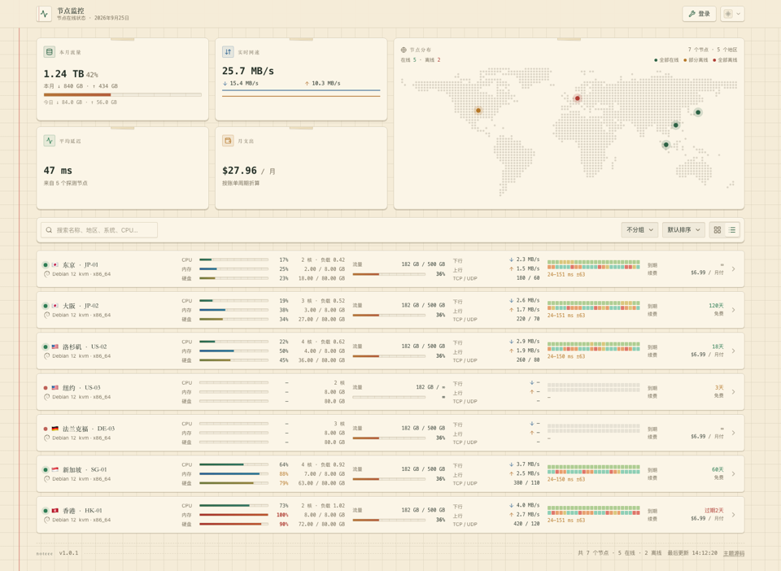
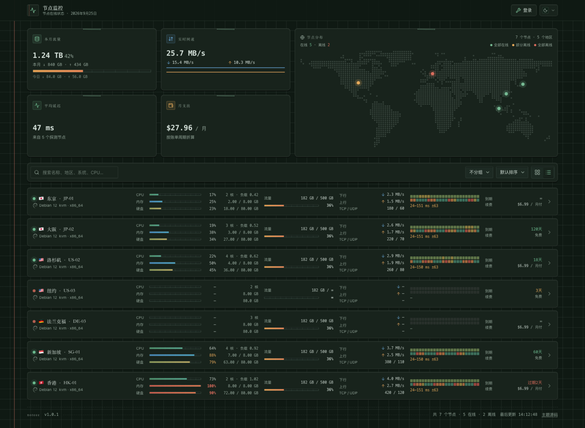

# noteee — ProbeDeck 适配版

> **移植来源：基于 [`bluesmkun/noteee`](https://github.com/bluesmkun/noteee) 原主题源码移植并适配 ProbeDeck。**  
> 原作者：**bluesmkun**。本适配保留原主题 UI 与原作者署名，仅重写后端数据接入、单位和路由等必要部分。

## 这是什么

米黄方格纸配墨绿墨水，红色装订线、纸角胶带、盖章式在线状态和打字机等宽数字，把服务器指标做成一本摊开的手账。支持卡片 / 列表双视图、硬件占用、流量、延迟、到期与费用展示。

## 安装到 ProbeDeck

1. 将本仓库完整上传到 GitHub，默认分支设为 `main`。
2. 在 ProbeDeck 后台进入「主题」，选择自定义主题链接。
3. 填入：

```text
https://github.com/gg949/noteee-probedeck/tree/main/dist
```

> 不要填仓库根地址；ProbeDeck 需要的是构建产物 `dist/`。

4. 保存并启用。首次切换后等待约 1 分钟，或重启面板清理主题内存缓存。
5. 浏览器硬刷新；如果前面接 Cloudflare，再清理 Cloudflare 缓存。

## 后端兼容范围

- **ProbeDeck 2.13+**：支持 24 个探测点、批量历史接口、扩展 Ping 字段和 WebSocket 增量更新。
- **CF Server Monitor（CF 原版面板/官方探针）**：支持旧 8 个探测点、主题选项、历史接口和 WebSocket；最高显示后端支持的 7 天历史。
- CF 原版不提供 `node_5`～`node_20` 和 `probes[]`，因此只显示旧 8 个点，这是后端能力限制，不是主题故障。

## 预览

| 浅色 | 深色 |
| --- | --- |
|  |  |

## ProbeDeck 适配内容

- `/api/config`、`/api/servers`、`/api/server`、`/api/history/all` 与 `/api/ws` 数据接入
- UUID 节点 ID 与 `/#/server/<uuid>` 详情路由
- `batchUpdate` 增量推送、30 秒心跳、15 秒 REST 兜底与静默重连
- 最多 24 个探测点，包含 `node_5`～`node_20` 与每台自定义名称
- 内存、磁盘、Swap 的 MB → 字节单位转换
- 流量限制、账单周期、币种、上下行方向与在线阈值归一化
- 访客价格、到期、流量限制开关适配
- 主题配置改用 `/api/config` 的 `theme_options` / `POST /api/theme_options`
- 旗帜改用 ProbeDeck 内置 `/flags/*.svg`，不依赖第三方 CDN
- 构建产物整理为 `dist/index.html` + `dist/assets/*`

## 与上游版本的已知差异

- 原版 Monitor Hub 的 API、WebSocket 和历史接口已替换为 ProbeDeck 接口。
- ProbeDeck 探针不上报独立开机时长字段；主题按 `boot_time` 计算，缺失时显示 `—`。
- ProbeDeck 没有独立的“今日/月起始快照”字段；主题使用 `net_rx_monthly` / `net_tx_monthly` 和累计流量。
- 访客历史范围由面板 `public_history_hours` 控制。
- 原版主题设置接口已替换为 ProbeDeck `theme_options`。

## 本地构建

```bash
npm install
npm test
npm run build
```

构建结果位于 `dist/`。本地开发时可指定 ProbeDeck 地址：

```bash
PROBEDECK_URL=https://你的面板地址 npm run dev
```

## 署名与许可

本项目是基于 `bluesmkun/noteee` 的 ProbeDeck 适配版，原作者署名与上游项目链接保留。使用和再分发请同时遵守上游仓库的许可条款。
